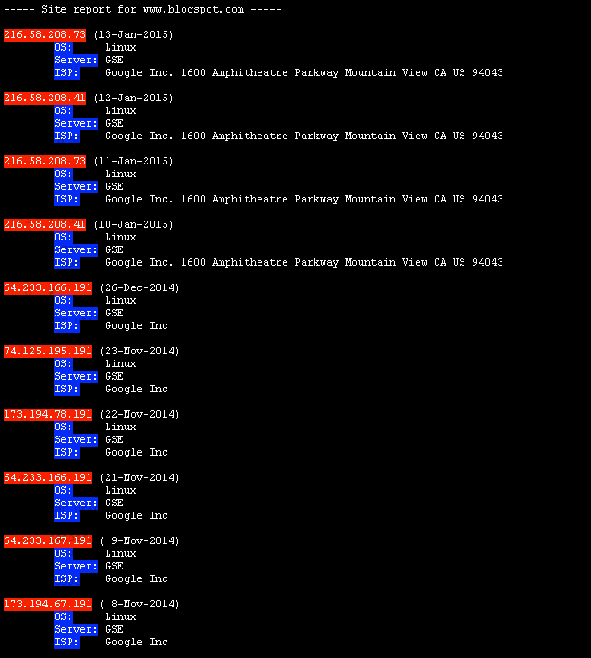

netcraftHostHistory
========================

Description
-----------

This is a ugly script for:

* get the historical info about a server: old IP and webserver brand.
* guess the origin server behind a CDN (reverse-proxy, Cloudflare, Akamai, Cloudfront...) scraping Netcraft webpage: 

scraping the horrible netcraft javascript webpage. I tried to solve the netcraft javascript issue using casperjs.

Install
-------

* phantomjs && casperjs global installation: ```npm -g install phantomjs casperjs```

Usage
-----

```./nhh.js blogspot.com```

or

```casperjs nhh.js blogspot.com```

Screenshots
-----------



Environment
-----------

I am using this script in:

* Linux Mint 13
* Ubuntu 10.04
* MacOS X 10.9.5 10.8.5

Notes
-----

* Cloned from my old gist. Original creation date: 25 Jan 2015.
* I am not a developer. I am a sysadmin. Sorry for my bad programming practices etc etc ......
